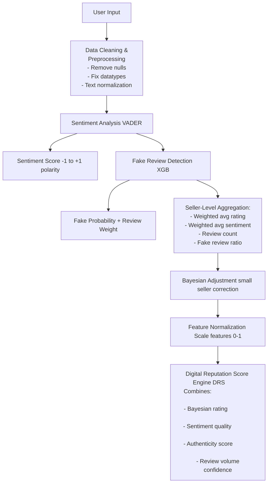

# Digital-Reputation-Score-for-Small-Businesses
🧩 **Overview**

  This project implements an AI-powered Digital Reputation Scoring (DRS) system designed to provide a fair and trustworthy evaluation of online sellers, with a focus on small businesses. 
  Traditional reputation systems rely heavily on average star ratings, making them vulnerable to fake or misleading reviews and disproportionately harmful to sellers with limited review volume. 
  To address this, the system combines:
  - sentiment analysis of review text
  - XGBoost-based fake review detection model that assigns a fraud probability to each review using behavioral, textual, and metadata features.
  Instead of removing suspicious reviews, their influence is reduced through probability-based weighting. Weighted ratings and sentiment are then aggregated at the seller level, normalized, and adjusted using Bayesian confidence modeling to account for low review counts.
**The final Digital Reputation Score integrates:**
- review quality
- emotional sentiment
- authenticity
- and confidence, resulting in an explainable, manipulation-resistant reputation framework that improves trust for both consumers and online marketplaces.

----------------------------------------------------------------------------------------------

🏗️ System Architecture

-----------------------------------------------------------------------------------------------
