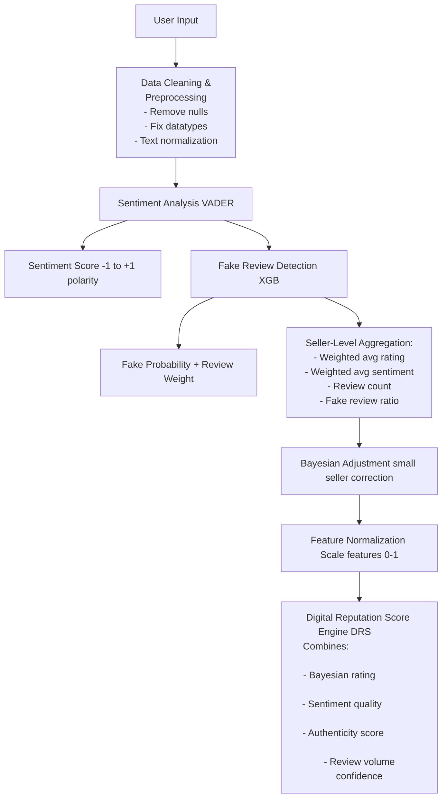

# Digital-Reputation-Score-for-Small-Businesses
🧩 ## **Overview**

  This project implements an AI-powered Digital Reputation Scoring (DRS) system designed to provide a fair and trustworthy evaluation of online sellers, with a focus on small businesses. 
  Traditional reputation systems rely heavily on average star ratings, making them vulnerable to fake or misleading reviews and disproportionately harmful to sellers with limited review volume. 
  To address this, the system combines:
  - sentiment analysis of review text
  - XGBoost-based fake review detection model that assigns a fraud probability to each review using behavioral, textual, and metadata features.
  Instead of removing suspicious reviews, their influence is reduced through probability-based weighting. Weighted ratings and sentiment are then aggregated at the seller level, normalized, and adjusted using Bayesian confidence modeling to account for low review counts.
**The final Digital Reputation Score integrates:**
- review quality
- emotional sentiment
- authenticity
- and confidence, resulting in an explainable, manipulation-resistant reputation framework that improves trust for both consumers and online marketplaces.

----------------------------------------------------------------------------------------------
## **Problem Statement**
Online marketplaces depend heavily on customer reviews and ratings to establish trust. However, these systems face several challenges:

Fake and manipulated reviews can artificially inflate or damage seller reputations.
Star ratings alone fail to capture the true sentiment expressed in review text.
Small businesses are disproportionately affected because a few reviews can significantly impact their ratings.
Customers lack a reliable way to determine whether a seller's reputation is genuine. As a result, existing reputation systems often provide an incomplete and sometimes misleading picture of seller trustworthiness.

----------------------------------------------------------------------------------------------

## **Solution**
The Digital Reputation Score (DRS) platform uses Artificial Intelligence and Machine Learning to generate a fair, explainable, and manipulation-resistant reputation score.

The system:

Analyzes review text using sentiment analysis.
Detects fake reviews using an XGBoost classification model.
Identifies suspicious or spam user accounts.
Assigns authenticity-based weights to reviews.
Applies Bayesian adjustment to ensure fairness for small sellers.
Aggregates multiple trust signals into a single Digital Reputation Score. 
This approach ensures that genuine customer feedback has greater influence while reducing the impact of fraudulent activity.

----------------------------------------------------------------------------------------------

## **Features**
### Customer Features
- View seller Digital Reputation Score (DRS)
- View seller reputation category (High, Moderate, Low)
- Browse customer reviews
- Submit ratings and written reviews
- Real-time sentiment analysis of submitted reviews
- Fake review detection for submitted reviews
- Spam account detection
- Trust indicators and reputation insights
- Transparency into how the reputation score is calculated
### Seller Dashboard
- View current Digital Reputation Score
- Monitor reputation trends over time
- Analyze customer sentiment
- View review authenticity metrics
- Track fake review activity
- Receive AI-generated reputation improvement suggestions
- Respond to customer reviews
- Monitor reputation alerts and performance indicators
- AI & Analytics Features
- Sentiment Analysis (VADER)
- Fake Review Detection (XGBoost)
- Spam User Detection
- Review Weighting Engine
- Bayesian Rating Adjustment
- Dynamic Reputation Score Updates
- Explainable AI Outputs
----------------------------------------------------------------------------------------------
🏗️ System Architecture

```mermaid
graph TD;
    A[User Input] --> B[ Data Cleaning &           
 Preprocessing             
 - Remove nulls            
 - Fix datatypes           
 - Text normalization];

    B --> C[Sentiment Analysis VADER] ;
    C --> E[Sentiment Score -1 to +1 polarity] ;
    C --> F[Fake Review Detection XGB];

    F --> G[Fake Probability + Review Weight];
    F --> H[Seller-Level Aggregation:  
 - Weighted avg rating  
 - Weighted avg sentiment  
 - Review count  
 - Fake review ratio];
    

    H --> I[Bayesian Adjustment small seller correction];
    I --> J[Feature Normalization Scale features 0-1];
    J --> K[Digital Reputation Score Engine DRS           
 Combines:                                      
 - Bayesian rating                              
 - Sentiment quality                            
 - Authenticity score                           
 - Review volume confidence  ];

```
## **Machine Learning Pipeline**
### Sentiment Analysis
Review text is analyzed using VADER sentiment analysis to determine whether customer feedback is positive, neutral, or negative.

### Fake Review Detection
An XGBoost model evaluates review patterns and assigns a fake review probability score. Suspicious reviews are not removed; instead, their influence is reduced through weighted scoring.

### Spam User Detection
User behavior patterns such as excessive review activity, repetitive content, and abnormal review frequency are analyzed to identify potentially spammy accounts.

### Reputation Aggregation
Reviews are aggregated at the seller level using authenticity-weighted scoring.

### Bayesian Adjustment
Bayesian adjustment prevents sellers with very few reviews from receiving misleadingly high or low scores.

-----------------------------------------------------------------------------------------------

## Digital Reputation Score (DRS)

**The Digital Reputation Score combines multiple trust indicators:**
- Rating Quality
- Customer Sentiment
- Review Authenticity
- Review Volume Confidence
  
**DRS Formula**
DRS =
0.35 × Bayesian Rating + 0.25 × Sentiment Score + 0.20 × Authenticity Score + 0.20 × Review Volume Confidence.

The final score is categorized as:

| Score Range | Reputation Level |
|------------|------------------|
| 0.00 - 0.40 | Low Reputation |
| 0.41 - 0.70 | Moderate Reputation |
| 0.71 - 1.00 | High Reputation |

-----------------------------------------------------------------------------------------------

## Future Enhancements
- Real-time review monitoring
- Multi-platform reputation aggregation
- AI-generated seller recommendations
- Reputation forecasting
- Marketplace integration APIs
- Advanced fraud detection models
- Explainable AI dashboards
